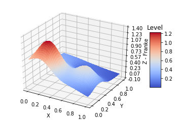

# Polynomial Regression

Project 1 in FYS-STK4155 Anvendt dataanalyse og maskinlæring, Fall of 2018 by Betina Høyer Wester, Mona Heggen and Henrik Gjestang. More details may be found in the [project report](https://github.com/henriklg/ising_model_analysis/blob/master/FYS_STK4155_project2.pdf).

*Goal*: Fit polynomials to the two-dimensional Franke's function, defined for x,y in [0, 1].

### a) Ordinary Least Square on the Franke function with resampling
 - Implement a function FrankeFunction(x,y), where x,y are random, uniformly distributed numbers. Optional stochastic noise with N(', infinity)
 - Code for standard least square regression analysis using polynomials in x and y up to fifth order. 
- Find the confidence intervals of beta by computing their variances. Evaluate the MSE and R^2 score. 
 - Perform a resampling of the data split in training data and test data. Implement k-fold cross validation and the bootstrap algorithm. Evaluate against MSE and R^2.

### b) Ridge Regression on the Franke function with resampling
 - Code for Ridge method, using either matrix inversion or SVD. 
 - Same analysis as previous exercise, for the same polynomials, but now for different lambda values. 
 - Study dependence on lambda.

### c) Lasso Regression on the Franke function with resampling
 - same as previous. Can use scikit-learn. 
 - give a critical discussion of the methods, judge which is best. 

### d) Introducing real data
Example of real terrain data
[Terrain example](figures/terrain_data.png)
